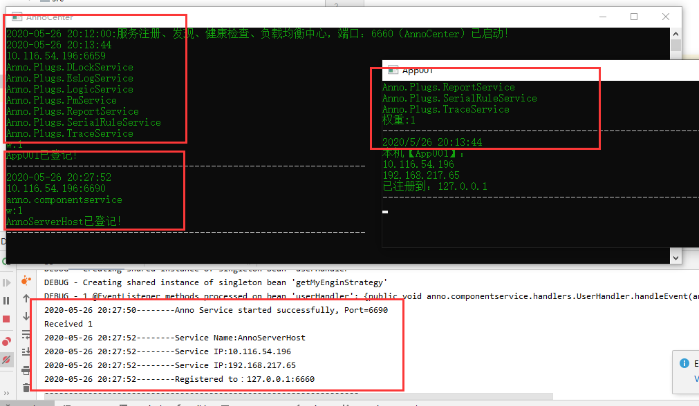
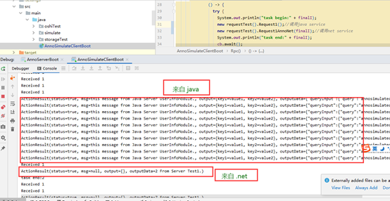
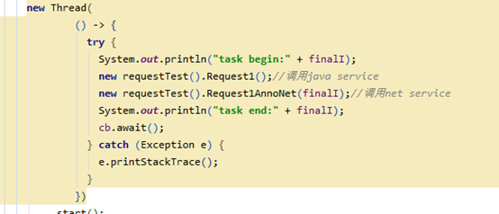
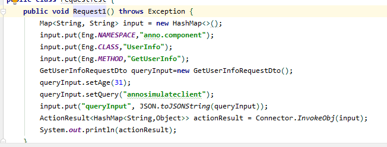
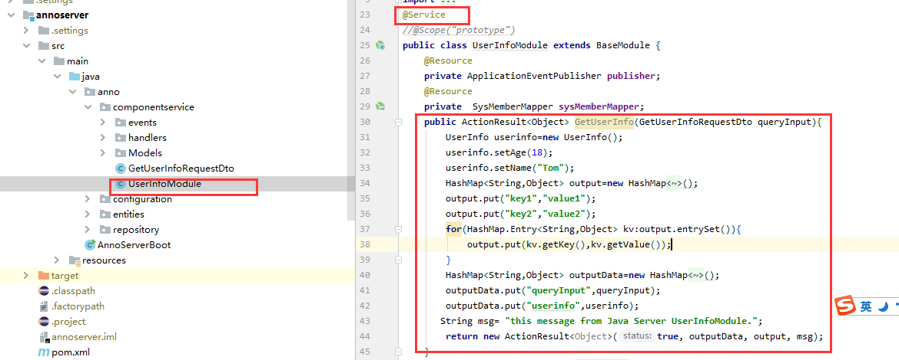
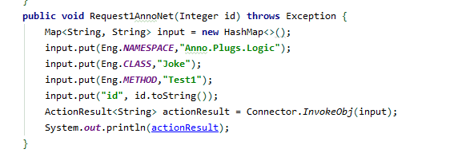
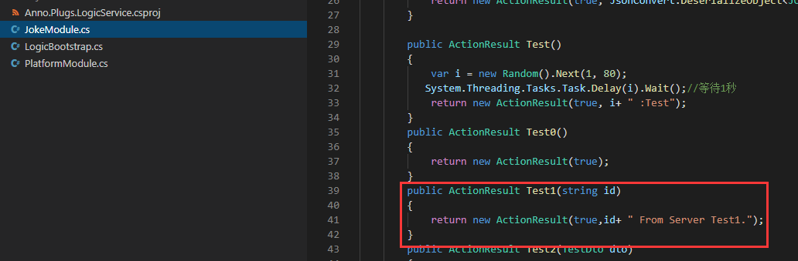

# Anno Java
    Anno 分布式开发框架，此项目是Anno Java的实现，包括类库、以及服务端、客户端的实现。    
# Anno 分布式微服务开发框架

**Anno 是一个分布式开发框架,专注于服务治理、监控、链路追踪。RPC可选用高性能跨语言的Thrift（推荐）、Grpc。同时支持 .net core 、.net framework。**

[在线演示](http://anno.liqingxi.cn/) :http://anno.liqingxi.cn

[示例项目](https://github.com/duyanming/Viper) :https://github.com/duyanming/Viper
# Java service 以及 Net 程序都注册到了 服务中心

# Java 调用 Java Service 和 Net Service 

# 代码

